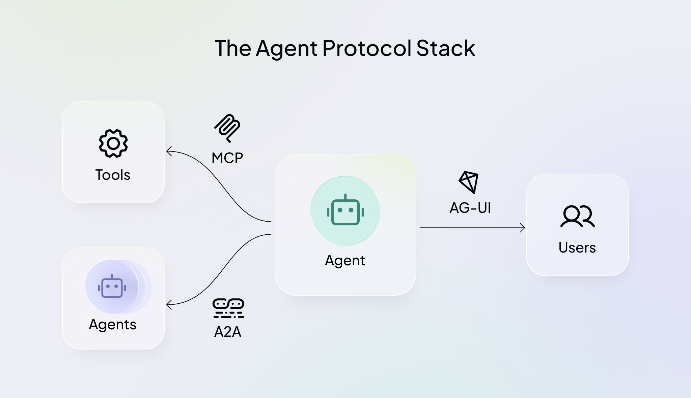

## Multi-Agent System
https://zhuanlan.zhihu.com/p/1930938911762411729
多Agent系统（Multi-Agent System, MAS）是Agent系统的发展趋势，因为它更适用于解决复杂问题求解、分布式任务、模拟社会系统等问题，在多Agent系统中，每个Agent 专注单一领域。

MCP协议——解决AI Agent和外部工具交互问题；
A2A协议——解决Agent间通信问题；
AG-UI协议——解决AI Agent与前端应用之间的交互标准化问题。

https://github.com/ag-ui-protocol/ag-ui

Agent系统框架的基础设施，让Agent 长出手脚（MCP）、拥有协作伙伴（A2A）、有入口能落地（AG-UI）。

## MCP 
MCP的“集散地”如 mcp.so 和 smithery.ai，目前已发布了数千个MCP Server。MCP 让Agent中对外部世界的工具“即插即用”，大量减少重复造轮子的工作，AI应用开发者可以使用开源的MCP Server或者定义自己的MCP Server，提高接入工具的效率。

## A2A
实现 AI 代理之间的无缝通信和协作。
https://github.com/a2aproject/A2A
模型上下文协议（MCP）：提供代理与工具之间的通信。它是一个补充标准，规范了代理如何连接到其工具、API 和资源以获取信息。
A2A：提供智能体之间的通信。作为一种通用的、去中心化的标准，A2A 充当公共互联网的角色，使人agent能够互操作、协作并共享其发现。

#### 事实标准
AutoGen和CrewAI等框架为开发者提供了构建多代理系统的即时端到端解决方案。框架侧重于快速应用开发，而A2A则定位为实现不同代理生态系统之间通信的长期标准。
A2A类通用协议因过于超前和缺乏应用载体未能流行，而AutoGen与CrewAI凭借解决实际开发痛点的“工具属性”占据市场主导地位。未来，AutoGen和CrewAI作为业务逻辑管理框架将长期存在，而A2A类协议的需求或将融入MCP等标准中，演变成Agent OS层面的调度器。

AutoGen、CrewAI 和 LangGraph 目前确实被视为多智能体（Multi-Agent）系统领域的“事实标准”。它们代表了三种完全不同的设计哲学，分别统治着各自的细分场景： 
- LangGraph (工业级标准)：因其基于有向图和状态机的设计，提供了最强的可控性和可观测性，是目前构建生产级、可审计工作流的首选。
- CrewAI (团队协作标准)：凭借直观的“基于角色（Role-based）”的任务委派机制，成为快速搭建“AI 虚拟团队”进行业务流程自动化的主流。
- AutoGen (对话研究标准)：由微软推出，擅长开放式对话、协作编码和动态任务解决，广泛应用于科研、原型设计和复杂的代码生成任务。 

这些框架已在多个行业实现了具体落地：
1. 金融与合规 (LangGraph 优势场景)
- 保险理赔处理：利用 LangGraph 的确定性逻辑，将理赔收集、策略核实、欺诈检测和最终决策连接为严谨的工作流节点。
- 合规性审查：在受监管行业（如银行）中，利用其可追溯性构建必须经过人工审核（Human-in-the-loop）的决策链条。
2. 内容创作与市场研究 (CrewAI 优势场景)
- 自动化内容生产流水线：一个 Agent 负责搜集素材，一个负责撰写草稿，另一个负责校对和 SEO 优化，模拟真实人类编辑部的协作。
- 市场趋势分析：快速部署研究员、分析师和报告撰写者角色的智能体团队，自动化生成深度商业智能（BI）报告。
3.技术开发与科研探讨 (AutoGen 优势场景)
- AI 协作 Debug 助手：多个智能体动态交流，共同分析代码逻辑、定位 Bug 并迭代生成优化方案。
- 法律文档风险评估：构建提取、解释和风险评估等多个专用智能体，通过多轮对话细化法律条文的理解。

在实际企业实践中，开发者常采用混合策略： 
使用 CrewAI 进行快速的原型验证（PoC），验证“AI 团队”完成任务的可行性。
一旦方案确定，使用 LangGraph 重构核心逻辑，以获得生产所需的稳定性和可观测性。
对于涉及高频代码生成或需要智能体之间“辩论”的部分，嵌入 AutoGen 的子模块。

## AG-UI
提供一个轻量级、事件驱动的开放协议，实现AI Agent与用户界面的实时双向通信。
客户端通过 POST 请求发起一次 AI Agent 会话；
建立 HTTP 流，如 SSE 或 WebSocket 等协议，实现事件的实时监听与传输；
每个事件都包含类型和元信息 Metadata，用于标识和描述事件内容；
AI Agent 持续以流式方式将事件推送至 UI 端；
UI 端根据收到的每条事件，实时动态更新界面；
同时，UI 端也可以反向发送事件或上下文信息，供 AI Agent 实时处理和响应；
https://webflow.copilotkit.ai

