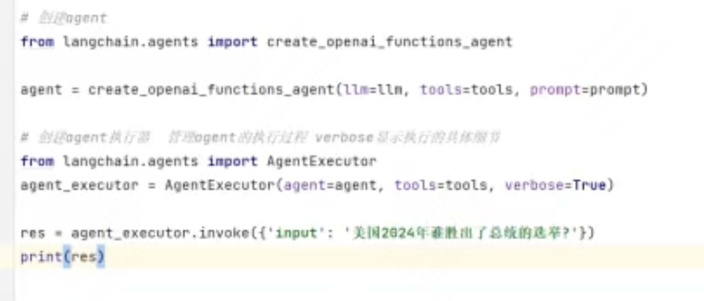

## RAG是什么
1.RAG（Retrieve and Generate）技术是一种增强大模型准确性和实时性的方法。
2.RAG技术通过检索外部数据来增强大模型的生成效果，减少幻觉问题。
3.RAG技术的工作流程包括索引化、数据分割、存储、检索、拼接和生成最终答案。

## 大模型存在的问题
1.大模型存在幻觉问题，即回答的内容与实际情况不符或前后矛盾。
- 幻觉问题源于大模型的架构设计，尤其是transformer架构的概率填充特性。
2.大模型的数据更新缓慢，无法实时更新最新数据。——RAG技术通过检索外部数据来增强大模型的生成效果。
3.大模型对专业领域知识的认知有限，尤其在广度优先的训练数据选择下。——RAG技术可以引入专业领域的知识进行回复，提高回答的准确性和时效性。

## RAG技术的实现流程
1.RAG技术的实现流程包括索引化、数据分割、存储、检索、拼接和生成最终答案。
2.索引化：将文档进行分片和存储，便于后续（全文）检索。
3.数据分割：将文档分割成小块，便于检索和存储。
4.存储：将分割后的数据存储到向量数据库中，转换为向量形式。
5.检索：根据用户问题在向量数据库中检索最相似的数据。
6.拼接：将检索到的数据与用户问题拼接，生成最终答案。

## RAG技术的演进
1.RAG技术的演进分为三个阶段：naive RAG、address RAG和module RAG。
2.naive RAG：基本的RAG流程，包括索引化、数据分割、存储、检索和拼接。
3.address RAG：在naive RAG基础上增加了前索引和后索引，提高检索效果。
4.module RAG：将RAG功能模块化，便于独立优化和扩展。

naive RAG技术的核心步骤包括文档获取、数据标注、文档分块、向量转换和存储。
- 文档获取：获取所需文档数据，可能需要进行数据清洗。
- 数据标注：对文档数据进行标注，确保数据质量和准确性。
- 文档分块：将文档分割成小块，便于后续处理和检索。
- 向量转换：将文档数据转换为向量形式，提高检索效率。
- 存储：将向量数据存储到数据库中，便于快速检索。

## 文档分块的方法
1.文档分块的方法包括按句子分割、按字数分割、按固定字符分割和递归分割。
2.按句子分割：根据标点符号将文档分割成句子。
3.按字数分割：将文档按固定字数（如100个字符）进行分割。
4.按固定字符分割：将文档按固定字符（如50个字符）进行重叠分割，确保语义完整。
5.递归分割：递归地将文档按固定长度进行分割，确保语义完整。


递归分割器优先使用反斜杠n进行分割，但需要空字符的优先级高于check size。
递归分割的逻辑是在分割完反斜杠n后，再根据空字符和控制符进行分割。
分割后的数据会变成单独的数据点，每个字符都会变成单独的向量。
如果数据长度小于分割值，则会合并数据；大于分割值则确保语义完整。

语义完整性，就是确保代码和数据在分割后的完整性。
递归分割器通过优先使用句号等语义符号进行分割，确保语义的完整性。语义完整的代码和数据在后续处理中更加准确和可靠。
from langchain.text_splitter import RecursiveCharacterTextSplitter
separators指定顺序：\n优先，然后是。 最后是空格。

## 向量的表示
1.向量在数学中表示为带箭头的线段，有大小和方向。
2.在编程中，向量用数组表示，每个下标I对应一个维度。
3.向量的维度可以很高，甚至达到几千维。

文本向量转换是将文本转换成一组浮点数，表示文本的语义特征。
向量之间的距离可以计算语义的相似度。通过计算余弦相似度和欧式距离来评估向量之间的相似度。

机器学习中常用One-Hot编码将字符转换为向量。
One-Hot编码将每个字符表示为一个高维向量，维度等于字符集大小。总共有N维，只有那个字符对应的位为1。
One-Hot编码适用于处理离散特征，但在高维空间中会占用大量内存。

## 嵌入向量（Embedding Vector）
1.嵌入是将高维向量映射到低维空间，同时保持语义关系。
2.嵌入过程通过算法将高维向量降维，同时保留重要的语义特征。嵌入后的向量仍能表示原始数据的语义信息。

使用成熟的向量模型将文本转换为向量，无需自行进行表示学习和嵌入。
常见的向量模型包括千问、百度文心等。通过OpenAI等平台连接向量模型，进行文本向量的转换。

不同向量模型的维度、支持的批次大小不同，是由训练时决定。
1.一个文档按500长度、重叠10长度切片后，可以切为很多段，在处理数据时默认会一次性处理所有传入的数据，即批次处理。不同向量模型，支持的批次大小不同。
2.批次处理的大小取决于模型能够支持的最大向量大小。
3.如果需要调整批次处理的大小，可以通过循环迭代的方式分批次处理数据。


可以使用哈根费舍等开源机器学习网址获取离线向量模型。

余弦相似度通过计算向量间的夹角余弦值来评估相似度，值越大相似度越高。
欧式距离直接计算两个向量间的直线距离，值越小相似度越高。


nilvus：元数据支持、混合检索、分布式支持。
chromadb: 默认存储在内存。
faiss：存储为2个文件
- pkl 存储源文档
- faiss 存向量


Q存为向量，方便按相似度查询。
A存为文档。

安装处理PDF的库，如PyPDF2和pdfminer。加载PDF文档并提取文本。

RAG步骤
1.步骤一：加载文档并进行转换：加载PDF文档并提取文本，去除空白行和特殊字符。
2.步骤二：对文档进行文本切片：将切片后的文本拼接成完整文本。
3.步骤三：将文本转换为向量并存储在数据库中。
4.步骤四：将用户问题，转成向量 检索相似答案(也可采用混合检索)。


1.模糊查询：根据关键词进行查询，速度较慢。
2.向量查询：在向量空间中进行查询，速度较快。
3.语义查找：向量查询可以根据语义进行查找。


## LangChain
在rag阶段的使用较多，便于开发和部署。
是一个用于开发大语言模型的框架，简化开发过程。
框架是成体系，包含开发、测试和部署的整个流程。类似于其他领域的框架，如java和spring

核心组件
1.模型：包含大语言模型、聊天模型和向量模型。提示词模板用于将用户问题转换为模型可以理解的查询语句。
2.链：核心语法机制，链式调用功能，简化开发流程。
3.数据增强：包括加载文档、文本向量化、向量存储和切片向量化。
4.检索器：封装查询方法，便于查询向量数据库。
5.回调：方法调用后的触发操作，如执行成功后的后续操作。
6.记忆：通过LangChain或额外组件实现记忆功能，记录之前的对话。
7.代理：赋予大模型额外的功能，如调用其他工具或服务。
8.输出解析器：自己决定输出JSON、CSV、XMLOutputParser等格式。

第三方开源组件基于LangChain框架开发，兼容LangChain。常见的第三方组件包括lunching call、community和long graph。
- langchain-core：核心语法库，包含大语言模型调用的基础功能。
- langchain-community：第三方集成，合作伙伴和社区库，集成各种大模型。比如langchain-openai
- langchain： 提供上面7个核心组件，属于应用组件。 
- langgraph：用于构建图结构的数据库。
- langserver/langsmith：用于部署和监控。

```
Langchain_connunity.docunent.loaders 获取网页文本（支持使用bs4解析），构建知识库；
WebaseLoader
https://docs.langchain.com/oss/python/integrations/document_loaders/web_base
```

vector_db.as_retriever()
1. 检索器封装了查询方法，提供了更全面的查询功能。
2. 通过检索器，可以更方便地构建查询语句和检索数据。检索器在语法之上进行了封装，简化了查询过程。——类似mybatis Example？
3. 检索器有很多类型（对应不同索引类型），比如按时序。

PromptTemplate/ChatPromptTemplate（设定角色）/FewShotPromptTemplate
不同的提示词模板适用于不同的场景和需求。
样本提示词模板用于提供示例输入和输出(input+opuput+description)，帮助模型学习。通过给定样本，模型可以学习如何根据输入生成正确的输出。适用于需要少量数据进行训练的场景。

都会将用户输入的问题，自动向量化，并按相似度查询K个文档，和原始问题拼接入prompt。 传给大模型。
similarity_search_with_score_by_vector

stuff_docunents_chain文档链
- StuffDocumentsChain 是 LangChain 框架中处理多文档最基础且最常用的一种文档链。它通过将多个文档的内容直接拼接（Stuffing）并填充到 Prompt 中，最后一次性提交给大语言模型（LLM）进行处理。


langchain支持的模型有三种，包括大模型、聊天模型和文本嵌入模型。
1. 大模型：输入和输出都是字符串，适用于文本生成任务。
2. 聊天模型：输入和输出包含用户和系统的信息，适用于对话生成任务。
3. 文本嵌入模型：将文本转换成向量，适用于文本相似度计算等任务。

```
from langchain_connunity.docunent_loaders import UnstructuredWordDocumentLoader
from langchain_connunity.docunent_loaders import PyPDFLoader
PyPDFLoader#load_and_split() 是按PDF页数切分。

text_splitter = RecursiveCharacterTextSplitter(
    chunk_size=200,
    chunk_overlap=100,
    length_function=len,
    )
```

## chain
链在内部把一系列的功能进行封装，而链的外部则又可以组合串联，链其实可以被视为LangChain中的一种基本功熊单元。
通过管道符将一系列功能组合在一起，形成链式调用。管道符进行传递参数。
基于runnable对象(langchain 0.2核心抽象)，实现方法的组合和调用。链中可以自定义runnable，干自己需要的事。

0.2版本新语法：prompt | model | output_parser

管道符在python中，会触发类中的魔法方法。__or__ , __ror__ 左边操作和右边操作。
就是将管道符前面的数，传给管道符后面的function。
链式调用缺点是不易调试。


#### chain运用示例
Connect your AI agents to the web
https://www.tavily.com/ 允许agent在线查询

旅游助手
- 构建景点知识库：景点开放时间，建议游玩时间……
- 借助tavily搜索天气信息
- LLM生存旅游规划

首先用LLM判断用户问题，是否需要查询天气，还是景点推荐or行程规划。
- 你是一个旅游助手。需从用户问题中提取景点和咨询类型（天气/景点介绍/行程规划）
- 你是专业旅游项问，请集合景点信息和天气生成建议。

RunnableMap
RunnableBranch 分支路由


LLMMathChain将用户问题转换为数学问题，然后将数学问题转换为可以使用 Python的 numexpr 库执行的表达式。他用运行此代码的输出来回答问题。
LLMMathChain就是在内置prompt里拼接里few shot（数学问题的样例）。


create_sql_query_chain 创建时指定DB，提问的question可以制定查询的表
- 将用户问题，转成SQL查询语句
- 执行查询、返回结果。


## agent
智能体是一种利用大模型执行任务和做出决策的系统；
可以提供不同的工具，给agent在需要时调用；agent根据用户问题决策何时调用哪个工具。

https://smith.langchain.com/hub Prompt社区


智能体的执行逻辑包括管理工具、agent和工具的执行流程。
管理工具负责分发任务，agent根据用户问题选择调用相应的工具。
agent通过大模型构建执行思路，选择合适的工具进行查询并整合结果。

RAG不同领域的知识增强，也可以作为一个个agent。


langchain.core.tools 可以将py方法封装成Tool（小写的）；
每个Tool都有name、description、func。

MessaqesPlaceholder占位符，是给agent用于存储中间结果；agent验证执行结果时，将上一步结果拼进prompt，替换占位符。——一个prompt 多次使用时有差异。


fron Langchain.tools inport tool （小写的）
可以在方法上加上@tool，把py方法（需要增加注释，填写name、description）封装成Tool。


## 聊天记录
LLM是无状态的；
聊天记录存储：通过RunnableWithMessageHistory创建聊天记录存储。
获取聊天记录：通过get方法获取指定ID的聊天记录。


ChatMessageHistory 保存了一个列表；每条记录分为user的message和 AI的message。
MessaqesPlaceholder占位符，用于预留上一次对话的信息。

在同一个窗口，存储的对话次数越多，装入下次对话prompt的上下文越长；需要取舍。

get_session_history(session_id)
save_nenory(filepath, session_id)
load_nenory(filepath, session_id)


## LangSmith
是一个用于构建、调试和监控大语言模型（LLM）应用的平台，由LangChain 团队开发。它帮助开发者跟踪LLM的调用，性能和输出，优优提示词（Prompr）设计，并管理数据集和译估。
通过LangSmith平台优化提示词并生成在线模板。


## RAG问题及解法
RAG执行流程：加载原始文档、读取文件、原始文档分割、文本向量化、向量数据存储、用户问题向量化、相似度匹配、问题相关文档提取、数据与原始问题拼接、提问与回答。
RAG存在的问题：内容缺失、错过排名靠前的文档、提取内容与上下文无关、格式错误、回答内容不完整、未提取到答案、答案不具体或过于具体。
- 向量构建过程问题：文档准确性、效率、分割颗粒度。——增加高质量知识数据、数据清洗、优化文档加载与分割。
- 问答过程问题：错过排名靠前的文档、提取内容与上下文无关、格式错误、回答内容不完整、未提取到答案、答案不具体或过于具体。——优化提示词、增加召回数(topK)、数据重排。

增加召回数,topK越大，消耗时间越长。


高级RAG的实现方式：预索引和后索引
- 预索引：查询重写（让LLM在不改变用户意图的情况下重新表述）、查询转移（问题拆分成多个关键词分别检索）、查询拓展（对原始问题进行拓展）。
- 后索引：重新排序、摘要、融合。

高级RAG的变体：TRAG、CRAG、CF-RAG、Graph RAG、RAG Fusion、Rewrite-Retrieve-Read RAG（高分回复进行奖励）。
Graph RAG：利用知识图谱进行检索，适用于关系型数据。

T-RAG树状结构能够更好地处理长文档和短文档的匹配问题。


CRAG的工作流程
1. 提出问题：用户向CRAG提出问题，CRAG进行检索和匹配。
2. 文档匹配：CRAG检索相关文档，并对检索结果进行评估。
3. 检索评估：通过（LLM）检索评估器判断检索结果的正确性、失败或模棱两可。
4. 文档分割与整合：对匹配成功的文档进行分割和整合，生成最终回复。
5. 错误处理：对匹配失败的文档，CRAG采用鲁棒性机制进行处理，通过搜索引擎搜索其他相关信息。

Self-RAG的工作流程
1. 提出问题：用户向Self-RAG提出问题，Self-RAG首先生成(3个)简单回复。
2. 评估：向大模型进行再次提问，对回复进行评估，判断其正确性。
3. 最优回复选择：选择最优的回复作为最终回复。
4. 错误处理：对不确定或错误的回复，Self-RAG采用鲁棒性机制进行处理，通过搜索引擎搜索其他相关信息。

RAG-Fusion
1. 用户提问 让大模型把问题 进行拓展多个
2. 分别向问最数据库中检索 每个问题 相关的文档
3. 把检索到的问题 进行重组 重组之后进行融合。


检索RAG与微调FT的比较
1. RAG：利用外部知识库进行动态检索，依赖于检索质量。
2. FT：将知识植入模型，提高模型在特定领域的性能。
3. 适用场景：RAG适用于动态更新的数据，FT适用于静态存储的数据。
4. 数据要求：RAG对数据要求较低，FT对数据要求较高。
5. 可解释性和道德隐私：RAG本质上不产生幻觉，FT可能产生幻觉；RAG不涉及道德和隐私问题，FT涉及道德和隐私问题。


---
document.querySelector('video').playbackRate = 1.6